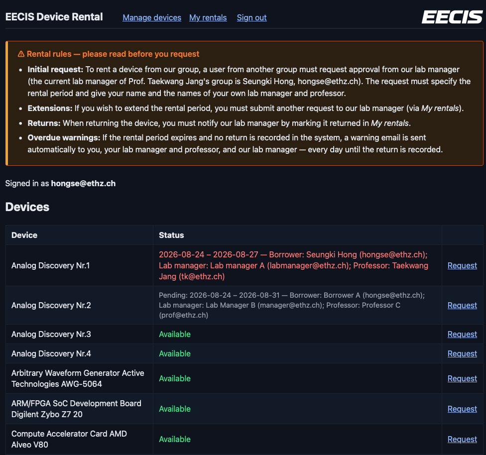

# EECIS Device Rental

**Live site: https://skethz.github.io/eecis-device-rental/**



A small website that replaces the "Rental Record" sheet in `EECIS_DEVICE_LIST.xlsx`. Members of other groups sign in with their `ethz.ch` email, request to borrow an EECIS device, request extensions, and mark devices returned. The lab manager never has to log in — every decision is made by clicking a link in an email.

## The five flows

1. **Request.** A borrower signs in, picks a device, and fills in the request form (dates, their name, their lab manager's name/email, their professor's name/email). Submitting sends an email to the lab manager with an **Approve** and a **Deny** link. Clicking either link opens a confirmation page on the website ("you are about to approve/deny this") — nothing changes until you press the button on that page. Once decided, the borrower gets an email with the outcome.
2. **Extension.** From "My rentals", a borrower with an approved rental can request a new (later) end date. This sends the same kind of approve/deny email to the lab manager, and the borrower is emailed the outcome.
3. **Return.** From "My rentals", the borrower marks the device returned. The lab manager gets a confirmation email; no approval is needed for this step.
4. **Overdue warnings.** Every day, a scheduled job checks for approved rentals whose end date has passed and haven't been warned about today. It emails the **borrower**, the borrower's **lab manager**, the borrower's **professor**, and **our lab manager** (`LAB_MANAGER_EMAIL`). This repeats every day until the device is marked returned.
5. **Device proposal.** Any signed-in user can propose a device on the *Devices* page. That sends the same kind of approve/deny email to the lab manager; approving inserts the device into the rental list, and the proposer is emailed the outcome either way.

## Using it as a borrower

- Sign in on the site with your `ethz.ch` address (an 8-digit code is emailed to you, no password) and request a device from the Devices list.
- Watch your email for the approve/deny decision, and check "My rentals" any time to see status, request an extension, or mark a device returned.
- If a rental becomes overdue you (and your lab manager, professor, and ours) will get a daily reminder email until it's marked returned.

## Proposing a device

If your group buys a device that should be rentable through this site, you don't need admin access to add it:

1. Sign in and open **Devices / propose a device** in the nav (`site/devices.html`).
2. Fill in the proposal: your name, the device's name and (optionally) maker and model, its `Nr.`, whether it carries a physical "Nr.x" sticker, and a note for the lab manager.
3. Submitting stores a row in `device_requests` and emails the lab manager an **Approve**/**Deny** link — the same single-use-token flow the rental requests use. You get a receipt email straight away.
4. On **Approve** the device is inserted into `devices` (active, so it shows up in the rental list immediately) and the proposal records its `device_id`. On **Deny** nothing is added. Either way you get an email with the outcome.

Your own proposals and their status are listed under the form; an admin sees everyone's there, with a **Proposer** column. If the proposed device already exists in the list, approving returns "that device already exists" and the proposal stays pending, so the lab manager can deny the duplicate instead.

## Setup checklist (one-time, owner)

Do these in order. Commands assume the Supabase CLI is installed and you're in the repo root.

1. **Create a Supabase project** (Dashboard → New project). Note the project ref (the short id in its URL) and the database password.
2. **Link the CLI to the project:**
   ```
   supabase login
   supabase link --project-ref <ref>
   ```
3. **Enable extensions before pushing.** In the Dashboard go to Database → Extensions and enable `pg_net` and `pg_cron`. This must happen before the next step, since migration `0005` uses both.
4. **Generate two random secrets:**
   ```
   openssl rand -hex 24   # will become webhook_secret
   openssl rand -hex 24   # will become cron_secret
   ```
5. **Create the three Vault secrets.** In the Dashboard's SQL editor, run (substituting your ref and the two values from step 4):
   ```sql
   select vault.create_secret('https://<ref>.supabase.co/functions/v1', 'functions_url');
   select vault.create_secret('<webhook_secret from step 4>', 'webhook_secret');
   select vault.create_secret('<cron_secret from step 4>', 'cron_secret');
   ```
6. **Push the schema:**
   ```
   supabase db push
   ```
7. **Set up Gmail SMTP.** Use the Google account `<your-gmail-address>` with 2-Step Verification turned on, then create an [App password](https://myaccount.google.com/apppasswords) for it (Gmail rejects SMTP login with the normal account password once 2-Step Verification is on).
8. **Set the Edge Function secrets.** `WEBHOOK_SECRET` and `CRON_SECRET` here **must be the exact same values** as the `webhook_secret` and `cron_secret` you put in Vault in step 5 — they're compared byte-for-byte.
   ```
   supabase secrets set SMTP_USER=<your-gmail-address> SMTP_PASS=<app password> MAIL_FROM="EECIS Rental <<your-gmail-address>>" LAB_MANAGER_EMAIL=hongse@ethz.ch WEBHOOK_SECRET=<same as vault webhook_secret> CRON_SECRET=<same as vault cron_secret> SITE_URL=https://skethz.github.io/eecis-device-rental
   ```
   `SMTP_HOST` (`smtp.gmail.com`) and `SMTP_PORT` (`465`) default correctly and don't need to be set explicitly. Note Gmail always rewrites the `From` address to the authenticated account (`<your-gmail-address>`), regardless of `MAIL_FROM`'s display name; the lab manager still appears as `Reply-To`. Gmail's SMTP limit is about 500 emails/day.
9. **Deploy the edge functions:**
   ```
   supabase functions deploy notify decide overdue-check
   ```
   `supabase/config.toml` already sets `verify_jwt = false` for all three (they authenticate themselves — see the comment in that file). On older CLI versions that don't honor that setting, deploy with `--no-verify-jwt` instead as a belt-and-braces measure.
10. **Configure Auth.** Dashboard → Authentication → URL Configuration:
    - Site URL: `https://skethz.github.io/eecis-device-rental/`
    - Redirect URL: `https://skethz.github.io/eecis-device-rental/**`
    - Make sure the email provider (sign-in code) is enabled.
    - **Custom SMTP (so sign-in code mail also goes through Gmail instead of Supabase's limited built-in sender):** Dashboard → Authentication → Emails → SMTP settings (or via the management API), and set host `smtp.gmail.com`, port `465`, user `<your-gmail-address>`, password = the same app password from step 7, sender email `<your-gmail-address>`, sender name `EECIS Rental`.
11. **Wire up the frontend.** Edit `site/config.js` with the project's URL and anon key (Dashboard → Project Settings → API), then commit and push.
12. **GitHub Pages** is deployed automatically by the workflow added in step 12 below (`.github/workflows/pages.yml`) on every push to `main`. The one manual step is setting Pages → Source to "GitHub Actions" once, which the maintainer does via `gh api`.

## Verify it works

Run through this checklist end to end with a real `ethz.ch` address after setup:

1. Sign in on the site with an `ethz.ch` address.
2. Request a device.
3. Approve it via the link in the lab-manager email → check the confirmation page appears → press **Confirm approve**.
4. Confirm the borrower receives an approval email.
5. Request an extension from "My rentals" and approve it the same way.
6. In the Supabase Table Editor, set a rental's `end_date` to yesterday.
7. Trigger the overdue job manually:
   ```
   curl -X POST -H "Authorization: Bearer $CRON_SECRET" https://<ref>.supabase.co/functions/v1/overdue-check
   ```
8. Confirm the overdue warning arrives (borrower, their lab manager, their professor, our lab manager).
9. Mark the rental returned from "My rentals" and confirm the return email arrives.
10. Propose a device from the *Devices* page, approve it the same way, and confirm it appears in the device list.

### Lost or missed decision email

Every request creates a single-use token in the `action_tokens` table. If the Approve/Deny email is lost, open Supabase → Table Editor → `action_tokens`, copy the `token` whose `target_id` is the rental id (or, for `kind = 'device'`, the `device_requests` id) and whose `used_at` is empty, and open
`https://skethz.github.io/eecis-device-rental/decide.html?token=<token>&action=approve` (or `&action=deny`).

## Day-to-day

- **Editing inventory.** Sign in as an admin and open the *Devices* page (`site/devices.html`); the **Edit devices (admin)** section at the bottom is visible only to admins. It lists every device — inactive ones included — with an editable row for name, maker, model, unit number, *labelled* and *active*, plus an "Add a device" form. Devices are never deleted: untick **Active** to retire one so the rentals referencing it keep working. You can still edit the `devices` table directly in the Supabase Table Editor, or update `EECIS_DEVICE_LIST.xlsx` and regenerate the seed SQL:
  ```
  /opt/anaconda3/bin/python3 scripts/seed_from_xlsx.py
  supabase db push
  ```
- **Adding an admin.** Supabase Table Editor → `admins` → Insert row, and put the person's `ethz.ch` address in `email` (the address they sign in with, exactly). That is the whole mechanism: `public.is_admin()` checks that table, the RLS policies on `devices` allow insert/update only when it returns true, and the site shows the "Edit devices (admin)" section only to those users. Remove a row to revoke access.
- **Unlabelled devices.** 14 devices in the xlsx exist but carry no physical "Nr.x" sticker. They are stored with `labelled = false` and `unit_no = 1`, and everything that names a device (the site, the emails) leaves the " Nr.x" suffix off for them. Tick/untick **Labelled** in the admin device table if that ever changes.
- **Who has a device.** The Devices list shows, for every device, each current or upcoming approved rental and each pending request, with the borrower's, their lab manager's and their professor's name and email. Every signed-in ETH user can see this (a deliberate decision, so people know whom to ask); it comes from the `device_status` view.
- **Changing the lab manager email.** Update the secret and redeploy so the running functions pick it up:
  ```
  supabase secrets set LAB_MANAGER_EMAIL=new-address@ethz.ch
  supabase functions deploy notify decide overdue-check
  ```
- **Logs.** Dashboard → Edge Functions → Logs shows each function invocation. Webhook delivery results from the database triggers (the `pg_net` calls to `notify` and the cron call to `overdue-check`) show up in the `net._http_response` table.
- **Cron time.** The overdue job runs at 06:00 UTC daily, which is 08:00 in Zurich during summer time and 07:00 during winter time.

## Development

Three independent test suites:

- **SQL/RLS tests** — needs a local Postgres running (`brew install postgresql@17`, `brew services start postgresql@17`):
  ```
  tests/sql/run.sh
  ```
- **Edge function tests:**
  ```
  cd supabase/functions && deno test
  ```
- **Frontend helper tests:**
  ```
  deno test site/app_test.js
  ```

### Repo layout

```
supabase/migrations/     schema, RLS policies, RPCs, seed data, webhooks/cron (0001-0005),
                         unlabelled devices + admins + device_status (0006),
                         device proposals (0007)
supabase/functions/      notify, decide, overdue-check edge functions (+ _shared/ email & SMTP helpers)
site/                    static frontend (index.html, request.html, my.html, devices.html, app.js, helpers.js, config.js)
tests/sql/                     SQL/RLS test suite + shim for local auth.users
scripts/seed_from_xlsx.py      regenerates the device seed SQL from the xlsx: 0004 (labelled
                               devices) and the generated block inside 0006 (unlabelled ones)
.github/workflows/pages.yml    deploys site/ to GitHub Pages on push to main
```
